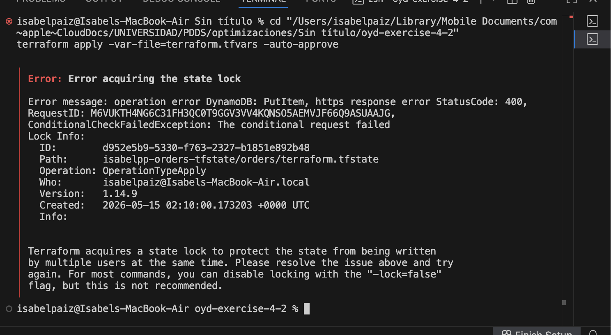

# oyd-exercise-4-2 — Orders Service Remote State Migration

Terraform workspace migrated from local state to S3 remote backend with DynamoDB locking.

- **State bucket:** `isabelpp-orders-tfstate`
- **Lock table:** `isabelpp-orders-locks`
- **State key:** `orders/terraform.tfstate`

## Evidence

### terraform state list (after migration)

```
aws_s3_bucket.order_attachments
```

### aws s3 ls s3://isabelpp-orders-tfstate/orders/

```
2026-05-14 20:04:43       2954 terraform.tfstate
```

### Lock contention (Terminal 2 error while Terminal 1 apply was running)


